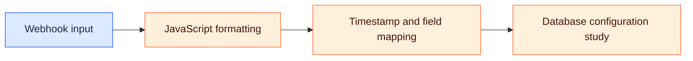

# Secure-Database-Webhook-Gateway-

[🌐 Naveen Sharma](https://naveensharma.net) · [💼 LinkedIn](https://www.linkedin.com/in/naveensharmatech/)

### 🗺️ Visual overview

Planned design only. This repository currently contains a concept description, without an executable workflow or verified run.

---

A baseline node-based middleware sandbox layer acting as a conceptual gateway for formatting payloads.  Target Scope: Mapping basic webhook listeners, utilizing JavaScript Code Nodes to format timestamps, and studying database configuration controls.

## 🎯 Learning focus

- Webhook payload handling
- JavaScript formatting and timestamp normalization
- Database field mapping and configuration

## 🧪 Before demonstrating a working version

- Add an exported workflow and setup instructions.
- Record a sample input and expected output.
- Test malformed data and failure paths.
- Attach a run screenshot or execution log once validated.

## 🔗 Explore more

[Automation & Agent Lab](https://github.com/naveensharmatech/ai-automation-agent-lab) · [Website projects](https://naveensharma.net/#projects)
